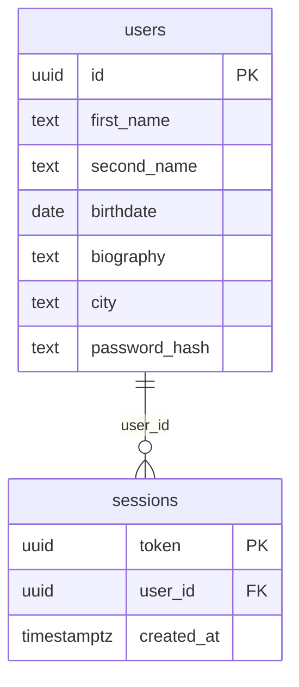

## Схема базы данных



`sessions.user_id` ссылается на `users.id`. У пользователя может не быть сессий или быть несколько.

## Допущения учебного проекта

- Токен авторизации — случайный UUID без срока действия. После успешного входа предыдущие токены этого пользователя удаляются, остаётся один действующий токен.
- Имя и фамилия не длиннее 100 символов, город не длиннее 100, биография не длиннее 2000. Пароль от 8 до 72 символов. Хеш bcrypt принимает не больше 72 байт, поэтому более длинная в байтах строка тоже отклоняется. Тело запроса не больше 64 КБ.

## Интеграционные тесты

Нужен запущенный Docker: тесты сами поднимают PostgreSQL через testcontainers и проверяют регистрацию, вход и чтение анкеты.

```bash
make test-integration
```

## Запуск в Docker

Нужен Docker. Команда собирает приложение и поднимает его вместе с PostgreSQL.

```bash
make docker-run
```

С хоста доступны:

- приложение — http://localhost:8080
- PostgreSQL — `localhost:5432`, пользователь `social`, пароль `social`, база `social`

Остановка:

```bash
make docker-stop
```

## Postman

Коллекция для приложения на http://localhost:8080: `docs/postman_collection.json`. Импортируйте её в Postman и выполняйте запросы по порядку.

- **Регистрация** — `POST /user/register`. Сохраняет `user_id` в переменную `userId`.
- **Вход** — `POST /login` с этим `userId` и паролем. Сохраняет `token`.
- **Анкета** — `GET /user/get/{{userId}}`.

Пароль по умолчанию — `Секретная строка`, его можно изменить в переменных коллекции. У запросов есть проверки ответа, папку можно прогнать через Collection Runner.

## E2E-тест

Нужен Docker. Тест останавливает уже запущенные контейнеры, заново собирает и поднимает приложение вместе с PostgreSQL и дожидается, пока API начнёт отвечать. Дальше проверяется один успешный сценарий.

```bash
make test-e2e
```

Проверяемые кейсы:

- `POST /user/register` с именем, фамилией, датой рождения, биографией, городом и паролем. Ожидается 200 и `user_id` в формате UUID.
- `POST /login` с этим `user_id` и тем же паролем. Ожидается 200 и `token` в формате UUID.
- `GET /user/get/{id}` с полученным `user_id`. Ожидается 200 и анкета с тем же идентификатором, именем, фамилией, датой рождения, биографией и городом. Пароля в ответе нет.

После теста контейнеры остаются запущенными.
